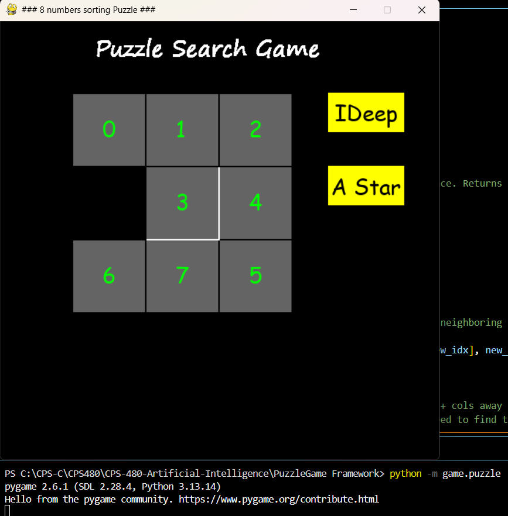
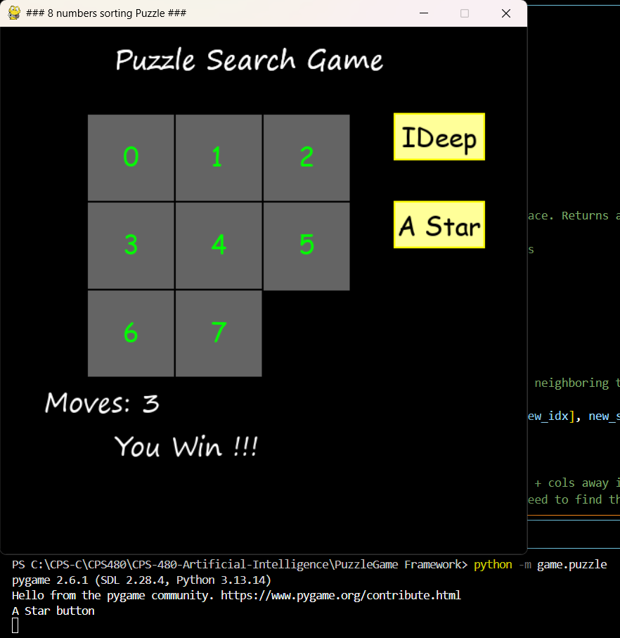

# A* Search for the 8-Puzzle — Implementation Report

**Name:** Lucas
**Course:** CPS 480 — Artificial Intelligence

## Overview

This project implements `astar(puzzle)` in `solution.py` to solve the 8-puzzle
using A* search. The puzzle is represented as a flat list of 9 values (0–7
plus `8` for the blank tile), and the function returns the sequence of
positions the blank moves through to reach the solved state
`[0, 1, 2, 3, 4, 5, 6, 7, 8]`.

## Heuristic Function — h(state)

The heuristic is the **sum of Manhattan distances**: for every tile except
the blank, I compute how many rows plus how many columns it is away from the
position it belongs in at the goal state, and sum that across all 8 tiles.

```python
def h(state):
    total = 0
    for idx, value in enumerate(state):
        if value == 8:
            continue
        row, col = divmod(idx, 3)
        goal_row, goal_col = divmod(value, 3)
        total += abs(row - goal_row) + abs(col - goal_col)
    return total
```

Manhattan distance is **admissible** — it never overestimates the
number of moves required, since every move can only change one tile's
position by exactly one row or column step. This is what guarantees A* using
it will return the shortest possible solution.

## Cost Computation — f(S) = g(S) + h(S)

- `g_score[state]` tracks the number of moves found so far. 
Every move costs exactly 1, so `g` increases by 1 with each step.
- `h(state)` estimates the remaining distance to the goal.
- Each entry pushed onto the priority queue is stored as
  `(f_score, tiebreak, state, path_so_far)`, where `f_score = new_g + h(new_state)`.
- I included a `tiebreak` counter so that if two entries share the same
 `f_score`, Python compares the counters.

## State Expansion Order

States are stored in a min-heap keyed on `f_score`. Popping from a
min-heap always returns the entry with the smallest value first, so the
search always expands the state with the lowest `f `('g + h') i.e the state
considered most promising given the cost so far plus the estimated cost
remaining.

## Optimal Path Guarantee

Because the heuristic is admissible and the heap always expands the
lowest `f` state first, the moment A* pops the goal state off the heap, the
path associated with it is guaranteed to be of minimal length.

## Example Run

Starting puzzle (scrambled by the framework):



After clicking **A Star**, the algorithm found and animated the optimal
solution in 3 moves:



The terminal output confirms the GUI correctly launched and the `A Star`
button triggered `solution.astar()`.

## Limitations

- **No solvability check.** Roughly half of all possible 8-puzzle
  permutations are mathematically unsolvable. This implementation assumes the input is solvable
  and will search indefinitely if it isn't. The provided framework only
  generates solvable puzzles, so this did not interfere with testing.